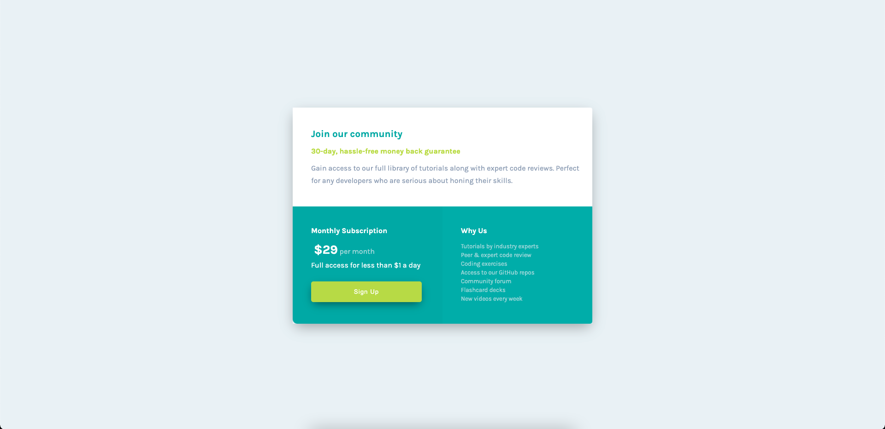

# Frontend Mentor - Profile card component solution

This is a solution to the [Profile card component challenge on Frontend Mentor](https://www.frontendmentor.io/challenges/profile-card-component-cfArpWshJ). Frontend Mentor challenges help you improve your coding skills by building realistic projects. 

## Table of contents

- [Overview](#overview)
  - [The challenge](#the-challenge)
  - [Screenshot](#screenshot)
  - [Links](#links)
- [My process](#my-process)
  - [Built with](#built-with)
  - [What I learned](#what-i-learned)
  - [Continued development](#continued-development)
- [Author](#author)
- [Acknowledgments](#acknowledgments)

**Note: Delete this note and update the table of contents based on what sections you keep.**

## Overview

### The challenge

- Build out the project to the designs provided

### Screenshot

### Links

- Solution URL: [https://kbrandon19.github.io/frontendmentor.io/]
- Live Site URL: [Add live site URL here](https://github.com/kbrandon19/frontendmentor.io.git)

## My process

### Built with

- Semantic HTML5 markup
- CSS custom properties
- CSS Grid
- Desktop-first workflow

### What I learned

At first I had some issues transitioning the page from desktop to mobile through flexbox. That's when I have put my progress up to that point to get feedback. I was recommened to use CSS Grid, which I honestly never thought about. This made thing reletively easier.

Improving the names of classes made my HTML cleaner and I elminated the use of incline CSS -- I've been doing a lot of HTML Email Dev lately so my mind is still in inline CSS mode.

I'm starting to understand why some elements have like 10 different classes and it make things a bit easier to code by not having to over analyze.

I know there are some things I still need to work on but overall, I am satisfied with my final solution, especially comparing it to what I initally had.

The only thing I'm still unsure of is putting the 'per month' text in the middle of '$29'.

### Continued development

In the future I will definiely utilize SCSS more, implement a mobile first workflow & semantic HTML, and code as must as possible, even if it means starting from the very beginning. 

## Author

- Website - [Kenneth Brandon](https://www.mrdebonairfox.com)
- Frontend Mentor - [@kbrandon19](https://www.frontendmentor.io/profile/kbrandon19)
- Twitter - [@MrDebonairFox](https://www.twitter.com/mrdebonairfox)

## Acknowledgments

Shoutout to Grace and Dave for the awesome feedback and advice!
